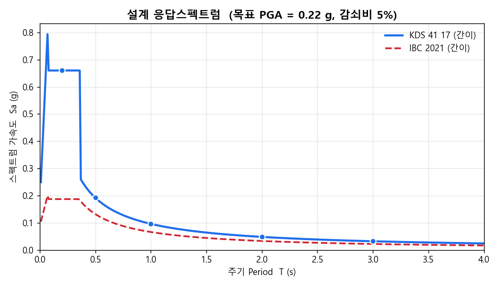
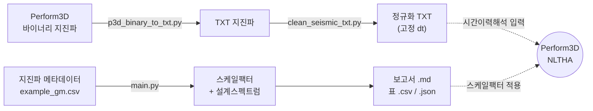
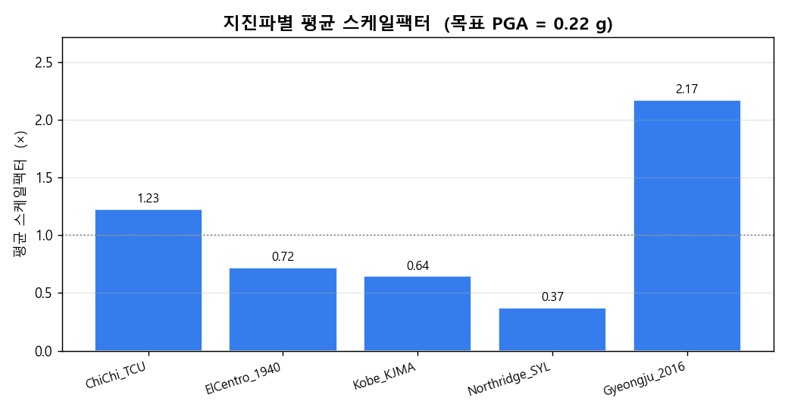
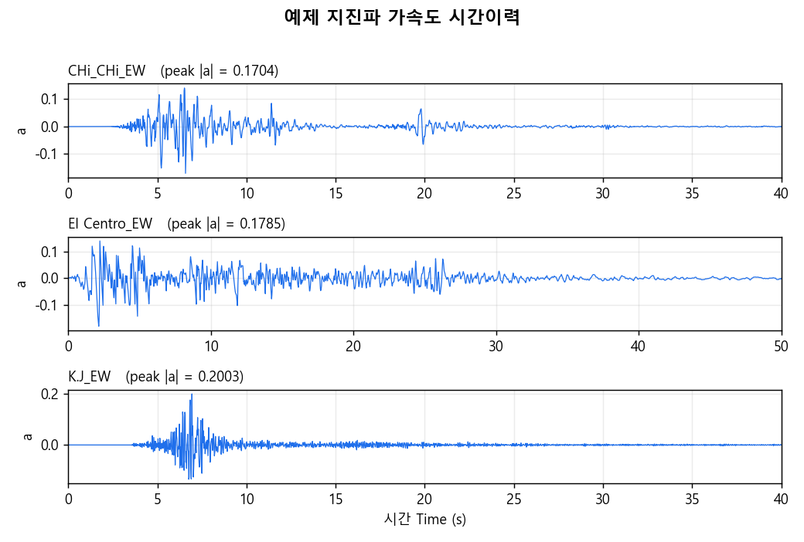

# 🌊 Ground Motion Scaling CLI

> 내진해석용 **지진파 스케일링 자동화** 도구 — 설계 응답스펙트럼 생성, 스케일팩터 계산, Perform3D 지진파 변환·정규화까지 한 번에.

<p>
  <a href="https://colab.research.google.com/github/titoliviomilazzo/GroundMotionScaling/blob/main/notebooks/quickstart.ipynb"></a>
  
  
  
</p>



---

## ▶️ 가장 빠른 시작 — Google Colab (설치 불필요)

학생이라면 **이 방법을 추천합니다.** 내려받기·설치 없이 브라우저에서 바로 실행됩니다.

1. 위의 **[](https://colab.research.google.com/github/titoliviomilazzo/GroundMotionScaling/blob/main/notebooks/quickstart.ipynb)** 배지를 클릭
2. 노트북이 열리면 위에서부터 각 셀을 `Shift + Enter` 로 실행
3. 스케일팩터·보고서·그림이 차례로 나옵니다

> 코드를 **고쳐서 내 것으로 보관/제출**하려면 오른쪽 위 **Fork** 후, Colab의 *파일 → GitHub에 사본 저장* 을 쓰면 됩니다. (자세한 안내는 노트북 마지막 셀)

---

## 📌 이게 뭔가요?

내진성능평가에서 **시간이력해석(NLTHA)** 을 하려면, 실제 관측 지진파를 그대로 쓰지 않고
**목표 설계 수준(PGA·응답스펙트럼)에 맞춰 크기를 조정(스케일링)** 해야 합니다.

이 도구는 그 반복 작업을 자동화합니다.

- **목표 응답스펙트럼**을 설계기준(KDS/IBC)으로 생성
- 여러 지진파의 **스케일팩터**를 일괄 계산
- 결과를 **보고서(Markdown) + 표(CSV/JSON)** 로 정리
- Perform3D **바이너리 지진파 → TXT 변환** 및 **dt 정규화(클리닝)** 유틸 포함

> ⚠️ **교육·학습용 도구입니다.** 응답스펙트럼은 강의 시연을 위한 **간이(simplified) 모델**이며,
> 실무 설계기준(KDS 41 17 / ASCE 7)을 그대로 구현한 것이 아닙니다. 실제 설계에는 정식 기준값을 사용하세요.

---

## ✨ 주요 기능

| 도구 | 기능 | 비고 |
|------|------|------|
| `main.py` | 설계 응답스펙트럼 생성 + 스케일팩터 계산 + 보고서 | KDS / IBC (ASCE7는 KDS로 대체, 개발 중) |
| `p3d_binary_to_txt.py` | Perform3D 바이너리 지진파 → TXT 변환 | Native dt + 0.02s 정규화 동시 출력 |
| `clean_seismic_txt.py` | TXT 지진파 중복 시간 제거 + dt 재샘플링 | Perform3D 임포트 오류 방지 |

---

## 🚀 빠른 시작

```bash
# 1) 설치
pip install -r requirements.txt

# 2) 스케일링 실행 (예제 데이터 포함)
python main.py --input examples/example_gm.csv --target-pga 0.22 --code KDS --output results/

# 3) 결과 확인
#   results/scaling_report.md   ← 보고서
#   results/scaling_factors.csv ← 스케일팩터 표
```

필요 패키지: `numpy`, `pandas`, `matplotlib`

---

## 🔧 워크플로



---

## 📊 결과 예시

### 1. 지진파별 스케일팩터

목표 PGA = 0.22 g 기준, 예제 5개 지진파의 평균 스케일팩터입니다.
저강도 지진파(경주 2016)는 **키워야(2.17×)**, 고강도 지진파(Northridge)는 **줄여야(0.37×)** 목표 수준에 맞습니다.



| 지진파 | X방향 | Y방향 | 평균 |
|--------|------:|------:|-----:|
| ChiChi_TCU      | 1.202× | 1.250× | 1.226× |
| ElCentro_1940   | 0.703× | 0.738× | 0.721× |
| Kobe_KJMA       | 0.638× | 0.651× | 0.644× |
| Northridge_SYL  | 0.364× | 0.381× | 0.372× |
| Gyeongju_2016   | 2.245× | 2.095× | 2.170× |

### 2. 지진파 시간이력

`p3d_binary_to_txt.py`로 변환한 예제 지진파(가속도 시간이력)입니다.



---

## 📖 도구별 사용법

### `main.py` — 스케일링 + 보고서

```bash
python main.py --input <CSV> --target-pga <g> [--code KDS|IBC] [--output DIR] [--damping 0.05]
```

| 옵션 | 설명 | 기본값 |
|------|------|--------|
| `--input`, `-i` | 입력 지진파 메타데이터 CSV (필수) | — |
| `--target-pga` | 목표 PGA (g) (필수) | — |
| `--code` | 설계기준 (`KDS`, `IBC`, `ASCE7`) | `KDS` |
| `--output`, `-o` | 출력 디렉토리 | `gm_scaled/` |
| `--damping` | 감쇠비 | `0.05` |
| `--periods` | 스펙트럼 주기 배열 (쉼표 구분) | `0.2,0.5,1.0,2.0,3.0` |
| `--verbose`, `-v` | 상세 로그 | off |

### `p3d_binary_to_txt.py` — Perform3D 바이너리 → TXT

```bash
# 단일 파일
python p3d_binary_to_txt.py "examples/perform3d_binary/El Centro_EW"

# 디렉토리 일괄 (출력 폴더 지정)
python p3d_binary_to_txt.py --dir examples/perform3d_binary/ --out examples/txt/
```

변환 시 두 가지 버전을 함께 출력합니다.
- `txt_native_dt/` : 원본 dt 유지 (중복 시간만 제거)
- `txt_0.02s/` : 0.02초 고정 dt로 재샘플링

### `clean_seismic_txt.py` — TXT 정규화

```bash
python clean_seismic_txt.py --dir examples/txt/ --dt 0.02
```

중복 시간 제거 → 시간 단조증가 확보 → 고정 dt 선형보간. **Perform3D 임포트 에러 해결**에 최적화되어 있습니다.

---

## 📥 입력 CSV 형식

```csv
gm_name,event,PGA_x,PGA_y,Sa_10_x,Sa_10_y
ChiChi_TCU,chi-chi-1999,0.183,0.176,0.402,0.388
Kobe_KJMA,kobe-1995,0.345,0.338,0.602,0.591
```

| 컬럼 | 의미 | 필수 |
|------|------|------|
| `gm_name` | 지진파 식별 이름 | ✅ |
| `PGA_x`, `PGA_y` | X/Y 성분 최대지반가속도 (g) | ✅ |
| `event`, `Sa_*` | 지진 사건명, 주기별 스펙트럼값 (메모용) | ❌ |

---

## 📂 프로젝트 구조

```
GroundMotionScaling/
├── main.py                  # CLI 진입점 (스케일링 + 보고서)
├── scaler.py                # 설계스펙트럼·스케일팩터 핵심 로직
├── report.py                # Markdown / CSV / JSON 보고서 생성
├── p3d_binary_to_txt.py     # Perform3D 바이너리 → TXT 변환
├── clean_seismic_txt.py     # TXT 지진파 정규화/클리닝
├── tools/
│   └── make_figures.py      # README용 그림 생성 스크립트
├── examples/
│   ├── example_gm.csv       # 예제 입력 CSV
│   ├── perform3d_binary/    # 예제 바이너리 지진파 (El Centro, Chi-Chi, Kobe)
│   ├── txt/                 # 변환된 TXT 지진파
│   └── output/              # 예제 스케일링 보고서
├── assets/                  # README 이미지
└── requirements.txt
```

---

## 🧮 응답스펙트럼 모델 (간이)

`scaler.py`는 3구간 설계 응답스펙트럼을 사용합니다.

```
T ≤ T₀          : Sa = PGA · (0.6 + 2.5·T/T₀)   (상승 구간)
T₀ < T ≤ T_s    : Sa = PGA · 2.5                 (등가속도 평탄 구간)
T > T_s         : Sa = PGA · (T_s / T)           (등속도 감쇠 구간)
```
여기에 감쇠보정계수와 중요도계수(`I_e = 1.2`)를 곱합니다.

> 📐 위 그림의 KDS 곡선에서 평탄부 직전에 보이는 **순간적인 오버슈트**는, 상승 구간 식이
> 평탄부 값(2.5·PGA)을 살짝 넘는 간이 모델의 특성입니다. 실무용 스펙트럼은 코너주기에서
> 연속이 되도록 정의되므로, 이 도구는 **개념 학습용**으로만 사용하세요.

---

## 🎓 학습 과제 아이디어

이 저장소를 수업 실습 베이스로 쓴다면:

1. **정식 KDS 41 17 스펙트럼 구현** — 간이 모델을 실제 기준식(`S`, `S_DS`, `S_D1`, 지반증폭계수)으로 교체
2. **응답스펙트럼 정합(Spectral Matching)** — PGA 단순 스케일링을 주기영역 정합으로 고도화
3. **ASCE 7 / IBC 분기 완성** — `design_spectrum()`에 미구현 분기 추가
4. **스펙트럼 플롯 자동화** — 스케일된 지진파의 실제 응답스펙트럼 vs 목표 스펙트럼 비교
5. **단위/검증 테스트 추가** — `pytest`로 스케일팩터 계산 회귀 테스트 작성

---

## 📄 라이선스

[MIT License](LICENSE) — 자유롭게 사용·수정·배포할 수 있습니다.

## 💬 문의

버그 제보·질문은 이 저장소의 [Issues](../../issues) 탭을 이용해 주세요.
